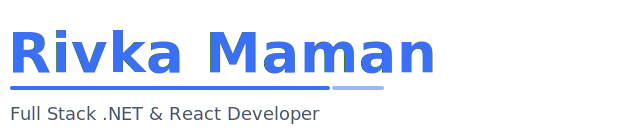

  

# Rivka Maman
### Full Stack .NET & React Developer

Driven Full Stack Developer with a strong architectural mindset, experienced in designing and building end-to-end software solutions that balance clean architecture, scalability, and impactful user experience.
I transform abstract concepts into well-structured, production-ready systems using modern engineering practices and continuous learning.

---

## About Me

I am a practical and analytical software engineer, combining strong theoretical foundations with real industry experience.
My approach to development emphasizes clarity, maintainability, scalability, and delivering real value to users.
I enjoy diving deep into problem-solving, designing structured systems, and turning ideas into functioning, meaningful products.

---

## What Makes Me Different

• Delivered real solutions for clients — not only academic projects — including full planning, development, deployment, and maintenance.  
• Excellence-based background: GPA 98, Mahat graduate, with extended program in Algorithms & Data Structures (Ultra‑Code, Kama‑Tech).  
• Currently advancing through Experis Full‑Stack Bootcamp (2025), strengthening hands‑on, industry‑oriented engineering skills.  
• Strong interest in software architecture, modern development practices, and applying AI to enhance engineering workflows.  
• High ownership, structured thinking, and commitment to continuous improvement.

---

## Tech Stack

**Backend**  
C#, .NET Core/6/8, Entity Framework, Web API, Python, Java, Node.js

**Frontend**  
React, Next.js, Angular, TypeScript, JavaScript, HTML, CSS

**Databases & ORMs**  
SQL Server, MongoDB, EF Core, LINQ

**Architecture & Methodologies**  
Clean Architecture, OOP, SOLID, REST, MVC, CI/CD Principles

**Tools & Dev Practices**  
Git, GitHub, Docker (basics), Jira, Postman, VS Code, Visual Studio

---

## Featured Projects

### English‑Learning Experience Platform
Full‑Stack interactive system for English learning using games, classroom management, progress tracking, and modular game architecture.  
**Tech:** Next.js, .NET Web API, MySQL, TypeScript, Tailwind, REST  
**Highlights:**  
• Scalable multi‑module architecture supporting multiple games within one platform  
• Reusable front‑end modules, game engine structure, and performance‑optimized flows  
• Clean separation of concerns and maintainable codebase  
**Repo:** https://github.com/rikiMaman/English-learning-experience

---

### Practicum Employee Management System
End‑to‑end system for business scheduling, service management, and operational workflows.  
**Tech:** Angular, C# .NET, SQL Server  
**Highlights:**  
• Scheduling engine, role‑based permissions, and JWT authentication  
• Full data modeling, API design, and UI/UX logic based on real business needs  
**Repo:** https://github.com/rikiMaman/Practicum-Project

---

### TinyURL – URL Shortening Service
Custom URL shortener service with redirection, data handling, and persistence.  
**Tech:** C#, .NET, SQL  
**Highlights:**  
• Efficient logic design with clean architecture and modular services  
• Backend‑focused problem‑solving and attention to code quality  
**Repo:** https://github.com/rikiMaman/TinyURL

---

## How I Work

I follow structured and professional development workflows to ensure code quality, maintainability, and smooth team collaboration.
My development habits include:

• Clear branching strategy, code reviews, and disciplined merging practices  
• Meaningful commit messages, documentation, and developer‑friendly structure  
• Testing and validating code before merging to ensure a stable main branch  
• Improving team workflows and development standards when needed

Strong engineering is not only what we build, but how we build it.

---

## Beyond Code

I value clarity, impact, and purposeful development — building software that serves real people and real needs.
Technology should simplify, support, and elevate the user experience.

---

## Education & Certifications

• Practical Software Engineering, Mahat — Graduated with Honors (GPA 98)  
• Ultra‑Code Excellence Program (Kama‑Tech): Algorithms, Data Structures, OS, Digital Systems  
• Experis Full‑Stack Development Bootcamp (2025)  
• Additional: AI foundations, Python for Automation & AI, Cloud Fundamentals

---

## Contact

• GitHub: https://github.com/rikiMaman  
• LinkedIn: https://www.linkedin.com/in/rivki-maman/
• Email: rivkim100@gmail.com

---

## Resume

(Will be added soon)
